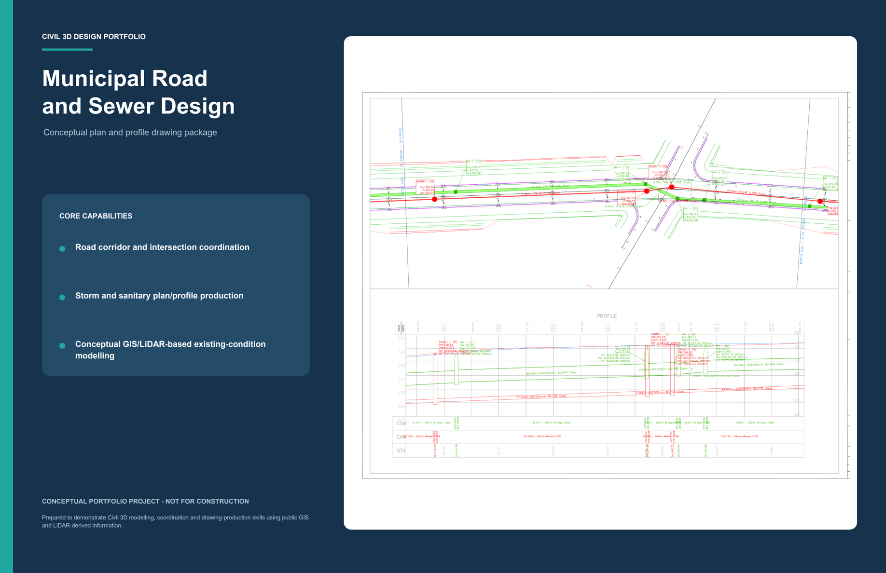
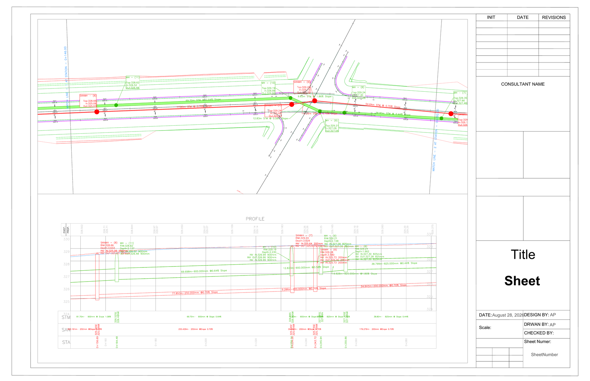

# Municipal Road and Sewer Design Portfolio


An anonymized Civil 3D portfolio project demonstrating a coordinated municipal road corridor with storm and sanitary sewer networks, plan/profile production, annotation, data bands, view frames, match lines, and colour sheet-set publishing.

> **Conceptual Portfolio Project - Not for Construction.** This repository demonstrates software and drawing-production skills. It is not an issued design, permit submission, tender package, record drawing, or construction document.

[](docs/Municipal_Road_and_Sewer_Design_Portfolio.pdf)

<div align="center">

**Click the cover to open the complete portfolio.**

</div>

## Portfolio

[View the complete seven-page portfolio PDF](docs/Municipal_Road_and_Sewer_Design_Portfolio.pdf)

The portfolio includes an overview, four plan/profile exhibits, demonstrated Civil 3D capabilities, and explicit data and professional-use limitations.

## Project at a Glance

| Design component | Demonstrated work |
|---|---|
| Existing conditions | Existing-ground surface assembled from publicly available mapping and LiDAR-derived terrain information |
| Road | Alignment, profile, corridor modelling and intersection lane-width coordination |
| Storm sewer | Pipes, maintenance structures, plan/profile display, labels and profile bands |
| Sanitary sewer | Pipes, maintenance structures, plan/profile display, labels and profile bands |
| Drawing production | View frames, match lines, plan/profile sheets, colour plotting and sheet-set publication |
| Quality review | Network/profile consistency, structure placement, slopes, inverts, cover and drawing readability |

## Drawing Sample



## Civil 3D Workflow

```text
Public mapping and terrain data
              |
              v
      Existing-ground surface
              |
              v
 Alignment -> profile -> road corridor
              |
              +---------> intersection coordination
              |
              v
    Storm and sanitary networks
              |
              v
 Plan/profile views and data bands
              |
              v
     View frames and sheet set
              |
              v
       Colour portfolio output
```

## Skills Demonstrated

- Civil 3D surface, alignment, profile and corridor organization
- Road geometry and intersection transition coordination
- Storm and sanitary pipe-network modelling
- Pipe and structure styles, annotation and profile display
- Profile bands for stations, pipe data and structures
- View frames, match lines, XREF coordination and sheet-set publishing
- Colour PDF production and drawing presentation

## Data and Engineering Limitations

Existing conditions were interpreted from public GIS and LiDAR-derived terrain information. Utility locations, elevations, materials and capacities require survey, records review, subsurface investigation, field verification and engineering review before real-world use.

The drawings have not been independently checked, approved, sealed, tendered or constructed. File existence and successful Civil 3D regeneration do not establish technical compliance or design suitability.

## Repository Structure

```text
.
|-- README.md
|-- PROJECT_NOTES.md
|-- docs/
|   `-- Municipal_Road_and_Sewer_Design_Portfolio.pdf
`-- assets/
    |-- portfolio-cover.png
    `-- plan-profile-sample.png
```

## Software

- Autodesk Civil 3D
- AutoCAD sheet sets and external references
- GIS and LiDAR-derived source information

## Author Note

This project is intentionally anonymized. The public repository excludes original survey data, GIS source files, proprietary references, editable production drawings and any real street name.
